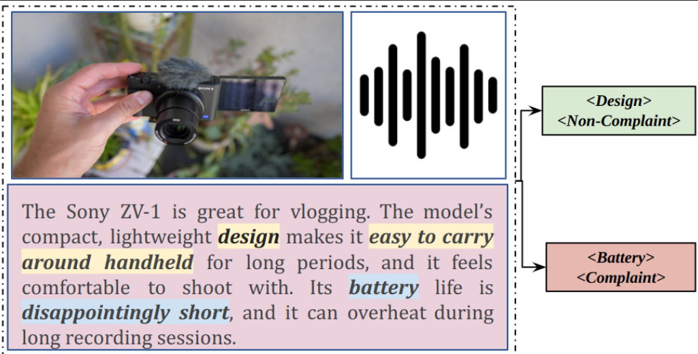
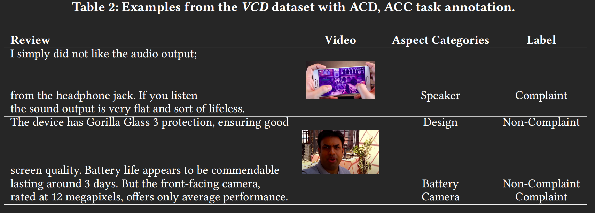
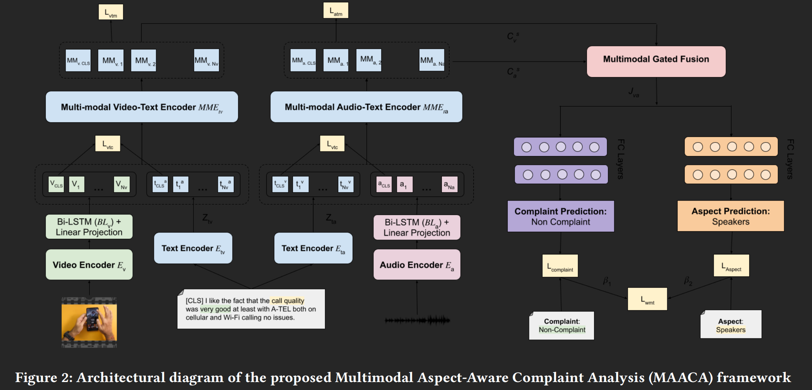
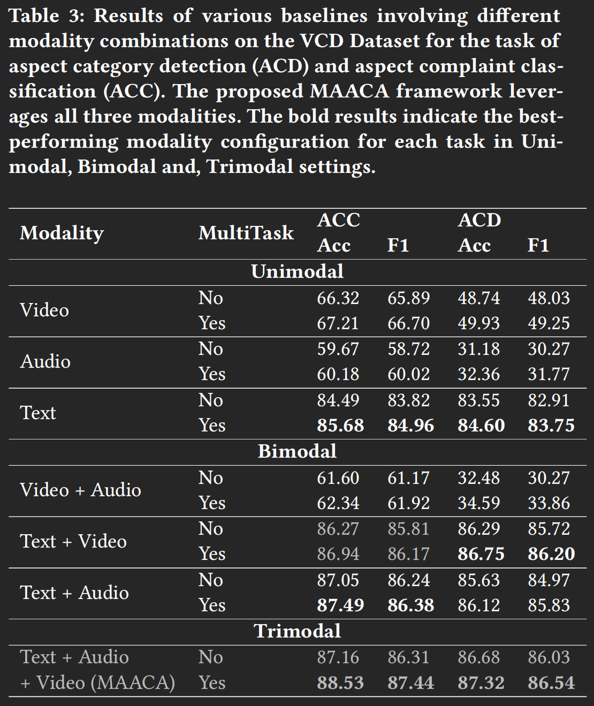
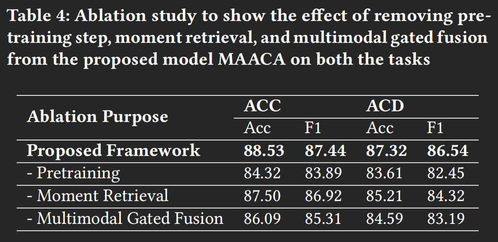

# Paper Reading Report
# Seeing Beyond Words: Multimodal Aspect-Level Complaint Detection in Ecommerce Videos
## 1. 成员
| 序号 | 学号 | 专业班级 | 姓名 | 性别 | 分工
| - | - | - | - | - | - |
| 1 | 3220103704 | 计科2202 | 周晓禾 | 男 | 全部内容
## 2. 论文背景与核心问题
### 2.1 论文背景
在传统方法中，电子商务视频检测抱怨 (Complaint) 主要依赖于文本和图像数据，但是实际上单纯依靠这些数据无法全面理解消费者的抱怨。
### 2.2 核心问题
基于文本、视频和音频等多模态数据，实现更加细致的方面级投诉检测 (Aspect-Level Complaint Detection from Discourse, ACDD)，检测具体哪些方面有没有收到投诉。

如上图中，对`Design`方面没有投诉，但对`Battery`方面有投诉
## 3. 研究方法与创新点
### 3.1 创新点
#### 3.1.1 抱怨视频数据集 (VCD)
抱怨视频数据集 (Video Complaint Dataset, `VCD`)，聚焦于130个电子产品评论（95条手机、22条笔记本电脑、13条相机）的`Youtube`视频，标注了方面级的抱怨/非抱怨标签，以及对应的起始和结束时间戳。

具体实现方式为，通过三位专业人士对投诉视频数据集进行标注，并通过`Fleiss-Kappa`协议分数评估一致性。评估显示，在方面类别检测 (aspect category detection, `ACD`) 和 方面投诉分类 (aspect complaint classification, `ACC`) 得分分别为0.76和0.84，表明了注释者之间的显著一致性

示例如下图

#### 3.1.2 方面级的多模态分析 (MAACA)
方面级的多模态分析 (Multimodal Aspect-Aware Complaint Analysis, MAACA)，在`ALPRO`的视频–文本对齐预训练策略基础上，引入音频–文本对齐损失（ATC），共同对齐文本、视频、音频三种模态，从而增强下游任务中的多模态表示能力。
- 使用相关帧的时刻检索
    
    时刻检索 (Moment-Retrieval)，并使用CG-DETR，利用视频和查询之间的相关性来预测每个视频的显著性得分，从而根据产品类别，获取更相关的方面级投诉。

#### 3.1.3 门控融合机制
门控融合机制 (gated-fusion mechanism)，针对文本对齐后的视频表示和音频表示，设计可学习的门控权重。既能动态平衡各模态贡献，又避免了简单拼接带来的冗余与干扰。

### 3.2 研究方法
#### 3.2.1 问题定义
- 输入
    
    对齐后的文本转录`T`、视频片段`V` (包含时间戳 $t_{ij}$)、音频片段A
- 输出
    
    针对每段话语给出若干对 <方面级类别, 是否抱怨>。
    
#### 3.2.2 时刻检索
使用 CG-DETR，根据 Phone / Laptop / Camera 类别，对未剪辑的原始视频进行检索，仅保留与产品最相关的高显著性区间，剔除简介、剪辑过渡等无关镜头，减少噪声干扰。
#### 3.2.3 模型架构
总架构如下图：

- 文本编码

    利用两个6层`BERT` ($ E_{tv}, E_{ta} $)，将视频-文本和音频-文本对齐，输出序列$ Z_{tv}, Z_{ta} $
    $$ Z_{tv} = E_{tv} (X_t) $$
    $$ Z_{ta} = E_{ta} (X_t) $$
- 视频和音频编码

    视频使用`TimeSFormer`提取`T=16`帧的视觉特征序列$ Z_v^{'} $
    $$ Z_v^{'} = E_v (X_v)$$
    音频使用`Whisper-small`将音频切片并映射为梅尔频谱，输出特征$ Z_a^{'} $
    $$ Z_a^{'} = E_a (X_a)$$

- 信息压缩

    对$ Z_v^{'}, Z_a^{'} $ 分别通过Bi-LSTM，保留最后 $ N_m $ 步输出 $ Z_m $，实现序列压缩
    $$ Z_m = BL_m(Z_m^{'}), m \in \{a,v\} $$
- 维度对齐

    线性层将 $ Z_m $ 投影到统一维度 $ D $，得到 $ Y_m $
- 多模态编码

    两个6层`BERT`($ MME_{tv}, MME_{ta} $)分别将$ [Y_v;Z_{tv}], [Y_a;Z_{ta}] $融合，输出跨模态表示$ C_v^s, C_a^s$

    $$ C_v^s = MME_tv (Y_tv) $$
    $$ C_a^s = MME_ta (Y_ta) $$

- 门控融合

    根据前述公式最终联合表示$J_va$ 
    $$ \alpha = \sigma (P_v C_v^s + P_a C_a^s + b_g)$$
    $$ J_va = \alpha C_a^s + (1 - \alpha) C_v^s $$
    其中，$\sigma$为`sigmoid`激活函数，$ P_v, P_a $ 为图像和音频的权重矩阵，$ b_g $ 为可广播的偏移量

#### 3.2.4 预训练策略
- 对比对齐

    本文在ALPRO 的视频–文本对齐基础上，额外引入了音频–文本对齐损失，为这两者分别构造双向的对比损失。
    $$
        \mathcal{L}_{m2t}
        = -\log
        \frac{
        \exp\bigl(s(Y_{m,i},\,Z_{t m,i}) / \tau\bigr)
        }{
        \sum_{j=1}^B \exp\bigl(s(Y_{m,i},\,Z_{t m,j}) / \tau\bigr)
        }\,,
    $$
    $$
        \mathcal{L}_{t2m}
        = -\log
        \frac{
        \exp\bigl(s(Z_{t m,i},\,Y_{m,i}) / \tau\bigr)
        }{
        \sum_{j=1}^B \exp\bigl(s(Z_{t m,j},\,Y_{m,i}) / \tau\bigr)
        }\,,
    $$

- 匹配任务

    该模块通过多模态编码器$ MME_{tv}, MME_{ta} $ 分别对视频-文本对和音频-文本对生成CLS向量，训练时采用二分类交叉熵损失：
    
    $$
        \mathcal{L}_{vtm}
        = \mathbb{E}_{(V,T)\sim \mathcal{D}_S}\;
        H\bigl(\mathbf{y}^{vtm},\,\mathbf{p}^{vtm}(V,T)\bigr)
    $$

    $$
        \mathcal{L}_{atm}
        = \mathbb{E}_{(A,T)\sim \mathcal{D}_S}\;
        H\bigl(\mathbf{y}^{atm},\,\mathbf{p}^{atm}(A,T)\bigr)
    $$

## 4. 实验结果与局限性
### 4.1 实验结果
#### 4.1.1 MAACA
实验结果中展示了提出的 MAACA 框架相较于不同基线模型（单模态、双模态、三模态）在 `ACC` 和 `ACD` 任务中的表现。

结果显示：
- 单模态

    `ACC`任务和`ACD`任务中，均为文本的表现最好 (`ACC`任务准确率84.49%, `F1`得分83.82%；`ACD`任务的准确率为83.55%，`F1`得分为82.91%)。
- 双模态

    `ACC`任务中文本+音频的效果最好 (准确率87.49%, `F1`得分86.48%)，`ACD`任务中文本+视频的效果最好 (准确率86.75%, `F1`得分86.20%)
- 三模态 (MAACA)

    `ACC`任务中准确率88.53%, `F1`得分87.44%；`ACD`任务中准确率87.32%, `F1`得分86.54%。

可以观察到，MAACA通过融合文本、音频、视频三个模态，得到了较高的准确率，同时精确率和召回率较高。

#### 4.1.2 消融实验 (Ablation study)
下图中展示了消融实验 (Ablation study) 的结果，研究了预训练 (Pretraining) 、时刻检索 (Moment Retrieval) 和多模态加权融合机制 (Multimodal Gated Fusion) 对模型性能的影响。

结果显示，这三项技术在`ACC`和`ACD`任务上均一定程度上提升了模型性能

### 4.2 局限性
#### 4.2.1 数据偏差
ALPRO的预训练模型是在来源网络的视频文本语料库上训练的，容易受到偏见（数据集可能严重偏向特定文化背景）的影响。
#### 4.2.2 模态缺失
该框架需要同时输入文本、视频、音频数据，如果缺失任何模态，将严重影响模型的预测准确性。
#### 4.2.3 冗余信息影响准确性
对于具有冗余信息的特定方面，模型无法正确识别；且冗余信息会加剧噪声或不相关因素对预测的挑战。
#### 4.2.4 抱怨语气不一致
音频和文字、图像等传达的内容可能不一致，这些各模态之间的不一致会导致模型混淆。例如"Why are the colours of the phone so boring and samey?"，评论者实际上在文字中表达了抱怨，但是在音频中并没有表达抱怨（可能是出于礼貌，使得评论者的音频偏向中性）。
## 5. 我的批判性思考
### 5.1 方法改进建议
#### 5.1.1 数据集领域扩展
数据集的领域偏差可能会影响模型的泛化能力，可以考虑构建更加多样化和跨领域的数据集，或者利用领域自适应技术，使得模型在不同领域或文化背景下的表现更加稳定。
#### 5.1.2 提高模型鲁棒性
可以考虑引入模态缺失的鲁棒设计，在使用少数模态时依然进行有效的预测。
#### 5.1.3 情感对齐机制
可以考虑使用更加先进的情感对齐机制，平衡不同模态的信息。
### 5.2 应用场景联想
#### 5.2.1 电子商务平台
最直接的，使用该模型可以直接应用在电商平台中，帮助平台自动识别用户对产品的细节抱怨，从而优化产品和服务。
#### 5.2.2 情绪识别
该模型的一个子任务是视频抱怨识别，可以进一步识别用户在视频中的面部表情、语调和身体语言等细节，应用于心理学研究或用户行为分析。
#### 5.2.3 社交媒体监控
该模型可以扩展到社交媒体上其他方面的视频评论和反馈，分析用户的抱怨情绪，及时发现潜在的用户不满情绪，从而进行及时公关应对。