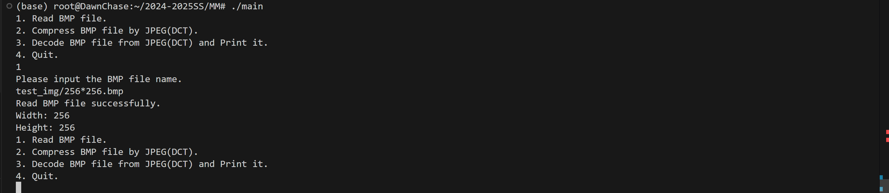
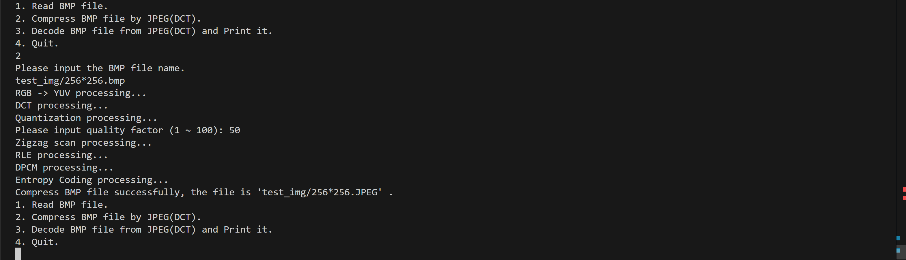
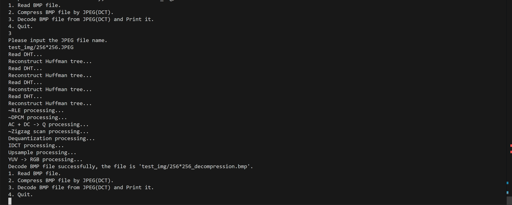

# 2024-2025春夏学期 多媒体技术 实验报告
### 分工：全部

## 1. 项目介绍
### 1.1 选题
高分辨率图像往往需要占用较大的存储空间，图像数据传输受到带宽限制等等问题，让图像压缩这个研究方向有了现实意义。

在本次实验中，我将实现`JPEG`的整个压缩和解压过程，探索有损压缩的流程和效果。
### 1.2 工作简介
本次实验中，我实现的功能有：
- 读取`BMP`图片
- 采用`JPEG (DCT)`压缩算法，对该`BMP`图片进行压缩
- 读取压缩后的文件，并解码
- 输出`BMP`图片
### 1.3 开发环境及系统运行要求
- 开发环境

    Ubuntu 20.04.6 LTS Windows Subsystem for Linux 2 (wsl2)
- 开发工具

    `VS Code`（C++等插件）
- 开发包
    1. `C++` 编译器（`g++`）
    2. 构建系统 `Makefile`
- 开源库

    bits/stdc++.h（无需手动额外安装）
    
    具体使用到的功能：
    1. vector 容器
    2. map 容器
    3. priority_queue 容器

- 操作流程
    
    在根目录下执行`make`命令即可生成可执行文件，执行`./main`即可运行可执行文件。
## 2. 技术细节
### 2.1 理论知识阐述
#### 2.1.1 无损压缩
- 基本原理

    无损压缩旨在在压缩后完全保留原始图像信息，解压缩后图像与原始图像完全一致。这类算法通常利用数据冗余来实现压缩，通过统计数据分布、重复数据模式或局部相关性来减少文件大小。
- 适用场景

    无损压缩适合对图像质量要求极高的场景，如医学影像、工程图纸、需要频繁编辑和保存的图像文件，以及任何不能接受数据损失的应用场景。
##### 2.1.1.1 `Huffman`编码
`Huffman` 编码是一种常用的无损压缩算法，主要用于降低数据冗余。它在图像压缩中常用于对经过变换和量化处理后得到的符号（如 `DCT` 系数经过量化后的结果）进行熵编码，进一步减少数据存储量。
##### 2.1.1.2 范式`Huffman`编码
范式哈夫曼编码(`Canonical Huffman Code`)<a href="#ref1">1</a>，是一种特殊的哈夫曼编码，借由一些原则以达成利用较少的数据便能还原霍夫曼编码的功能。具体规则如下<a href="#ref2">2</a>：

- 第一个编码 $code_1 = 0$
- 相同码长的编码 $code_i = code_{i-1} + 1$
- 不同码长的编码 $code_i = (code_{i-1} + 1) << k (k = delta(码长))$

##### 2.1.1.3 差分编码（`DPCM`）
差分编码通过表示相邻数据之间的差，而不是直接表示数据本身，来减少数据冗余。在`JPEG`压缩过程中，`DC`分量的变化较小，能够显著提高压缩效率。

如: `[150, 155, 149, 152, 144]`序列经过差分编码后，变为了`[150, 5, -6, 3, 8]`，大大减少了占用空间。

##### 2.1.1.4 游程编码（`RLE`）
游程编码将连续重复的数据替换为一个符号和它重复出现的次数，能够有效压缩连续相同的元素。在`JPEG`压缩过程中，`AC`分量有大量`0`，使用游程编码可以显著提高压缩效率。

如: `[6, -1, -1, 0 ,-1, 0, 0, 0, -1, 0, 0, 1, 0, 0, ..., 0]`序列经过游程编码后，变为了`[(0, 6), (0, -1), (0, -1), (1, -1), (3, -1), (2, 1), (0, 0)]`，大大减少了占用空间。
#### 2.1.2 有损压缩
- 基本原理
有损压缩在压缩过程中会舍弃一部分不容易被人眼察觉的图像信息，通过减少细节或色彩信息达到大幅减小文件体积的目的。这种方法在一定程度上牺牲了图像的精确还原，但在视觉效果上仍然能够保持较高的质量。
- 适用场景
有损压缩适用于对图像文件大小要求严格，而对细微图像细节损失可以接受的场景，如网络图片、数码相机照片、视频流媒体传输等。
##### 2.1.2.2 下采样（`subsample`）
下采样是指减少图像色度分量的分辨率。由于人眼对亮度信息比对色度信息更加敏感，色度信息的降低对视觉效果的影响较小。因此，在JPEG压缩中对图像的色度（`U`, `V`分量）进行下采样。从而能够在不显著降低图像质量的情况下大幅减少需要压缩的数据量。

常见的下采样模式有`4:2:2`, `4:2:0`等
##### 2.1.2.1 离散余弦变换（`DCT`）
离散余弦变换在图像压缩（例如 `JPEG` 压缩）中起到“能量集中”与“去相关化”的作用。通过将图像信号从空间域转换到频率域，`DCT` 能够将大部分图像信息集中在**较低频率**部分，从而便于后续的量化和编码。
##### 2.1.2.3 量化（`quantization`）
量化将频率较高的系数（通常对图像细节影响较小）赋予较小的值或零，而对低频系数（代表图像的主要特征和细节）保持较大的值。量化主要用于将DCT系数的精度降低，以减少图像数据的冗余，是最主要的压缩步骤之一。
### 2.2 具体算法描述
#### 2.2.1 读取BMP文件
`BMP`文件主要包含三大部分：位图文件头(`BMPFileHeader`)，位图信息头(`BMPInfoHeader`)，位图数据。

位图文件头(`BMPFileHeader`):
- 主要关注的部分是`bfType(0x4D42)`和`bfSize`(整个`BMP`文件的大小)

位图信息头(`BMPInfoHeader`):
- 主要关注的部分是`biWidth`(位图的宽)和`biHeight`(位图的高)和`biSizeImage`(位图的具体数据)
- 值得注意的是，图片的宽不一定是4的倍数，但在保存为图片时，会自动补齐字节。我们需要手动补全至4的倍数，防止整个图片错位。

位图数据：
- 为了简化处理，我没有使用调色盘，直接读入整个数据。
- 每连续的三个unsigned char分别为`B`, `G`, `R`分量

#### 2.2.2 JPEG图像压缩
##### 2.2.2.1 RGB -> YUV
为了在后续DCT处理时得到对称的变换输出，以及提高精度，我对基础变换公式稍作修改，使`Y`, `U`, `V`落在`[-128, 127]`上

$$
\begin{bmatrix} 
Y \\ U \\ V
\end{bmatrix}
=
\begin{bmatrix} 
0.299 & 0.587 & 0.114 \\
-0.1687 & -0.3313 & 0.5 \\
0.5 & -0.4187 & -0.0813
\end{bmatrix}
\cdot
\begin{bmatrix} 
R \\ G \\ B
\end{bmatrix}
+
\begin{bmatrix} 
-128 \\ 0 \\ 0
\end{bmatrix}
$$
##### 2.2.2.2 下采样
我采用了`4:2:0`的采样格式，即4个亮度样本共用1个色度样本。

方便起见，我直接对4个色度样本取平均，得到了1个色度样本。易知，`Y`分量大小不变，`U`, `V`分量均缩小为`1/4`
##### 2.2.2.3 分块`DCT`变换
参考文献<a href="#ref3">3</a>中给出的公式，直接使用即可，我采用的分块大小为`8*8`（即`N=8`）
$$
C(u, v) = \alpha(u)\alpha(v)\sum_x^{N-1}\sum_y^{N-1} f(x,y)\cos(\frac{\pi(2x+1)u}{2N})\cos(\frac{\pi(2y+1)v}{2N})
$$
$$
\alpha(u) = \begin{cases}
            \sqrt{\frac{1}{N}} & \text{for } u = 0 \\
            \sqrt{\frac{2}{N}} & \text{for } u \neq 0
            \end{cases}
$$

##### 2.2.2.4 量化
参考`JPEG`标准亮度(`Luminance`)量化表和标准色度(`Chrominance`)量化表，将`DCT`变换后的矩阵除以量化表后四舍五入即可。

亮度量化表：
$$
\begin{bmatrix}
16 & 11 & 10 & 16 & 24 & 40 & 51 & 61 \\
12 & 12 & 14 & 19 & 26 & 58 & 60 & 55 \\
14 & 13 & 16 & 24 & 40 & 57 & 69 & 56 \\
14 & 17 & 22 & 29 & 51 & 87 & 80 & 62 \\
18 & 22 & 37 & 56 & 68 & 109 & 103 & 77 \\
24 & 35 & 55 & 64 & 81 & 104 & 113 & 92 \\
49 & 64 & 78 & 87 & 103 & 121 & 120 & 101 \\
72 & 92 & 95 & 98 & 112 & 100 & 103 & 99
\end{bmatrix}
$$
色度量化表:
$$
\begin{bmatrix}
17 & 18 & 24 & 47 & 99 & 99 & 99 & 99 \\
18 & 21 & 26 & 66 & 99 & 99 & 99 & 99 \\
24 & 26 & 56 & 99 & 99 & 99 & 99 & 99 \\
47 & 66 & 99 & 99 & 99 & 99 & 99 & 99 \\
99 & 99 & 99 & 99 & 99 & 99 & 99 & 99 \\
99 & 99 & 99 & 99 & 99 & 99 & 99 & 99 \\
99 & 99 & 99 & 99 & 99 & 99 & 99 & 99 \\
99 & 99 & 99 & 99 & 99 & 99 & 99 & 99 \\
\end{bmatrix}
$$

##### 2.2.2.5 `Zigzag`重构矩阵
虽然可以通过手动模拟坐标移动实现`Zigzag`重构矩阵，但是在我的代码中，计算了`Zigzag`重构后的元素在原矩阵中的坐标，从而简化了代码。

注意先开一个临时矩阵存放结果即可。

`Zigzag`对应坐标矩阵如下：
$$
\begin{bmatrix}
0 & 1 & 8 & 16 & 9 & 2 & 3 & 10 \\
17 & 24 & 32 & 25 & 18 & 11 & 4 & 5 \\
12 & 19 & 26 & 33 & 40 & 48 & 41 & 34 \\
27 & 20 & 13 & 6 & 7 & 14 & 21 & 28 \\
35 & 42 & 49 & 56 & 57 & 50 & 43 & 36 \\
29 & 22 & 15 & 23 & 30 & 37 & 44 & 51 \\
58 & 59 & 52 & 45 & 38 & 31 & 39 & 46 \\
53 & 60 & 61 & 54 & 47 & 55 & 62 & 63
\end{bmatrix}
$$
##### 2.2.2.6 `DC`分量进行`DPCM`
如原理部分所说，对于`DC`分量，我们可以将其转化为差分编码：只有第一个值需要存放真实值，后面的值均存放与前一个值的差值即可。

由于后续的熵编码部分需要知道具体每个值占多少个`bit`，我利用`(size, amplitude)`二元组来表示每个DC分量：`size`表示了当前`DC`分量需要多少`bit`来存储，`amplitude`则为具体的值(与前一个值的差值)

##### 2.2.2.7 `AC`分量进行`RLE`
如原理部分所说，对于`AC`分量，我们可以将其转化为游程编码：每个编码是一个二元组`(skip, amplitude)`，`skip`表示跳过了多少个`0`，`amplitude`表示具体的值。

同理，后续的熵编码部分需要知道每个值占多少个`bit`，我利用`((skip << 4) + size, amplitude)`二元组来表示每个DC分量，`size`表示了当前`amplitude`需要多少`bit`来存储。

##### 2.2.2.8 熵编码
在前面的`RLE`和`DPCM`部分中，我们得到了若干个二元组`(value amplitude) (value = size / (skip << 4) + size)`，接下来我们需要对`value`进行`huffman`编码，从而减小占用空间。具体流程如下：

1. 使用`map`计算出各个`value`的出现次数，压入优先队列。
2. 利用优先队列，采用贪心算法，每次弹出出现次数最少的2个`value`节点并合并，成为新的`value`节点并再次进入优先队列。
3. 重复步骤2直到只剩下一个节点。
4. 得到普通的`huffman`编码。

在得到普通的`huffman`编码后，为了方便后续处理，我们需要将普通的`huffman`编码转化为范式`huffman`编码(`Canonical Huffman Code`)，具体流程如下：

1. 按码长从短到长排序（相同时按字典序）
2. 为每个编码赋予新的`huffman`编码，具体规则在理论部分已经给出

接下来，根据范式`huffman`编码将二元组`(value, amplitude)`输出到压缩文件中。当amplitude为负数时，转化为补码形式。

需要注意的是，由于`C++`中每次最小输出一个`byte`，因此我们需要手动计算每一个`byte`。

##### 2.2.2.9 保存格式
在保存压缩文件时，我部分参考了JPEG的保存方式<a href="#ref4">4</a>，可以分为以下三大部分：
1. 图像的宽、高
2. `DHT`（`huffman`编码表）
3. `huffman`编码后的信息

其中，2, 3部分实际上共有四次重复（亮度/色度 的 `DC/AC` 分量）

#### 2.2.3 JPEG图像解压缩
##### 2.2.2.1 熵解码
首先从压缩文件中读取出图像的宽、高。

接下来读取`DHT`，并根据范式`huffman`编码还原出编码，并构造出`huffman`树

接下来逐字节，读取并解码`huffman`编码后的信息，并存储为若干二元组`(value, amplitude)`，注意将部分`amplitude`还原为负数即可。

需要注意的是，不要多读任何字节，且注意AC分量的`size`实际上为`value & 15`即可。

##### 2.2.2.2 反RLE提取AC分量
从熵解码中，我们可以还原出若干`((skip << 4) + size, amplitude)`二元组。

接下来，只需要枚举每个块，计算AC分量即可。

需要注意的是，解析到`(0,0)`，即当前块结束时，需要手动将剩下的AC分量填充为0.

##### 2.2.2.3 反DPCM提取DC分量
从熵解码中，我们可以还原出若干`(size, amplitude)`二元组。

接下来，通过差值计算每个块的DC分量即可。

在该步骤之后，我将DC分量和AC分量合起来，还原了编码过程中`Zigzag`重构矩阵后的整个矩阵
##### 2.2.2.4 反Zigzag还原顺序
直接利用计算得到的`Zigzag`坐标对应表，还原原本顺序即可。

##### 2.2.2.5 反量化
将`Zigzag`还原后的矩阵乘上对应的标准量化表（亮度/色度）即可，具体的表内容与编码部分相同。

注：在JPEG真正实现中，量化表会放在压缩后的文件中，在这里方便起见，我直接使用了标准量化表。
##### 2.2.2.6 分块逆DCT变换
参考文献[1]中给出的公式，直接使用逆变换即可，我采用的分块大小为`8*8`（即`N=8`）
$$
f(x, y) = \sum_u^{N-1}\sum_v^{N-1}\alpha(u)\alpha(v)C(u, v)\cos(\frac{\pi(2x+1)u}{2N})\cos(\frac{\pi(2y+1)v}{2N})
$$
$$
\alpha(u) = \begin{cases}
            \sqrt{\frac{1}{N}} & \text{for } u = 0 \\
            \sqrt{\frac{2}{N}} & \text{for } u \neq 0
            \end{cases}
$$
##### 2.2.2.7 上采样
在编码时，我采用了`4:2:0`的采样格式，即4个亮度样本共用1个色度样本。

在解码部分，我采用了最近邻插值，将1个色度样本复制到4个相邻的色度样本，举例来说，原本位于`(0,0)`的色度样本将会扩充到`(0,0), (0, 1), (1,0), (1,1)`，以此类推。

从而，`U`, `V`分量扩大为4倍，恢复到了编码时下采样前。

##### 2.2.2.8 YUV -> RGB
由于我的`Y`, `U`, `V`落在`[-128, 127]`上，对基础变换公式同样需要稍作修改
$$
\begin{bmatrix} 
R \\ G \\ B
\end{bmatrix}
=
\begin{bmatrix} 
1 & 0 & 1.402 \\
1 & -0.3441 & -0.7141 \\
1 & 1.772 & 0
\end{bmatrix}
\cdot
\begin{bmatrix} 
Y + 128 \\ U \\ V
\end{bmatrix}
$$

需要注意的是，虽然我在整个计算过程中都使用了`double`类型，但由于存在一定的精度误差，我们仍然需要强制使最后的计算结果落在[0, 255]上（直接取`min(255, max(0, ans))`即可）

## 3. 实验结果
- 实验流程

    我使用的是命令行操作，具体操作流程和输出如下图：

    1. 读入`BMP`文件。将会输出该图像的宽和高
        
    2. 将`BMP`压缩为压缩文件。将会输出一系列压缩过程，最后提示压缩成功
        
    3. 从压缩文件中解码`BMP`文件，并输出为`BMP`图像。将会输出一系列解压缩过程，最后提示解压成功。
        

- 原图(lenna.bmp)
    
    
    
    大小为196,662字节

- 压缩文件(lenna.JPEG)

    

    大小为8052字节

- 解码图(lenna_decompression.bmp)

    

    大小为196,662字节

可以发现，压缩比大概为 24:1，压缩效果较好, 且还原出来的图片效果较好。

注：如果想要使用别的图片，请注意将宽和高裁剪为16的倍数（分块大小为8*8, 且下采样时对`U`, `V`通道的宽和高除了2）
## 4. 参考条目
1. <a name = "ref1" href="https://zh.wikipedia.org/zh-cn/%E8%8C%83%E6%B0%8F%E9%9C%8D%E5%A4%AB%E6%9B%BC%E7%B7%A8%E7%A2%BC">范式huffman编码(维基百科)</a>
2. <a name = "ref2" href="https://zhuanlan.zhihu.com/p/72044095">JPEG 中的范式哈夫曼编码(知乎)</a>
3. 
The Discrete Cosine Transform (DCT): Theory and Application

4. <a name = "ref4" href="https://ieeexplore.ieee.org/document/125072">The JPEG still picture compression standard(IEEE)</a>
