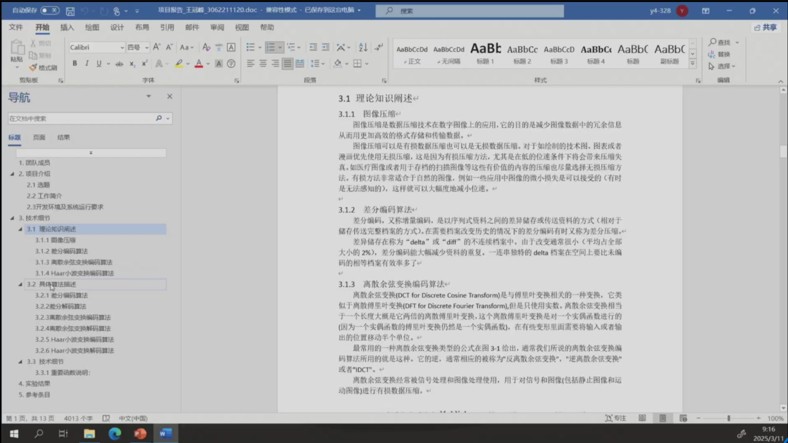
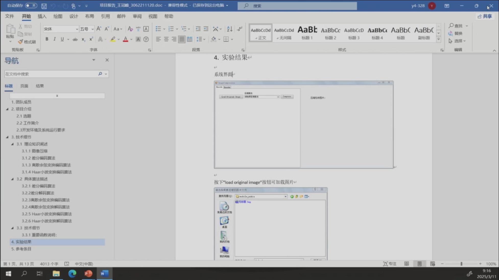

ZJU 2024-2025春夏学期 多媒体技术

1. Text Compressor (Lossless)

    Developing a tool to compress .TXT file based on Huffman, Arithmetic or LZW algorithm.
    - Load a .TXT file to display
    - Choose a compression algorithm
    - Compress the text content into a compressed file
    - Load the compressed file, decode and display

2. Image Compressor (Lossy)

    Developing an image compressor based on lossless or lossy compression algorithm
    - Load a BMP file to display
    - Choose a compression algorithm
    - Compress the original BMP file into a compressed file
    - Load the compressed file, decode and display

3. Video Filter

    Develop a video displayer which can apply different filters to the original video.
    - Load a video to play
    - Choose a filter and apply it to the original video
    - Display the filtered video

4. Other

代码 + 数据 + 实验报告

